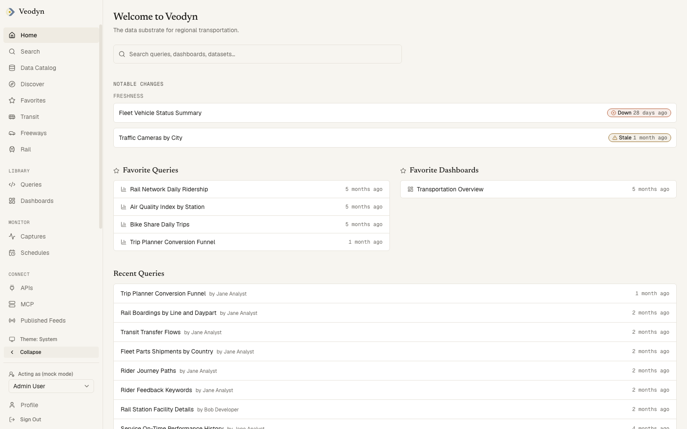
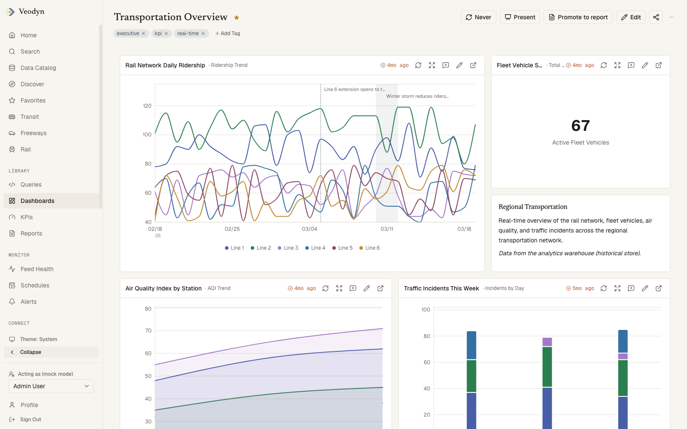
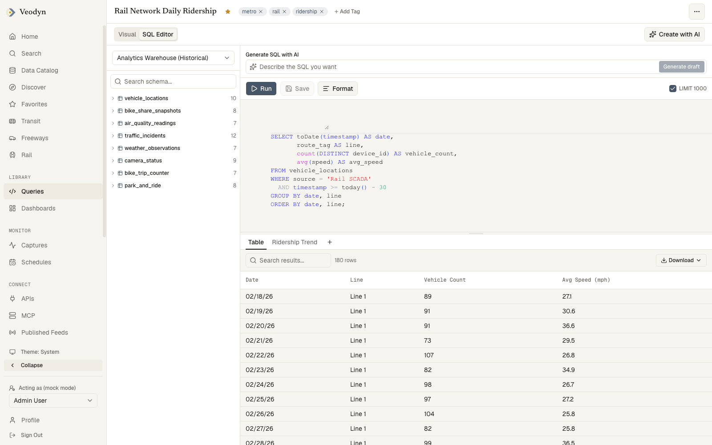
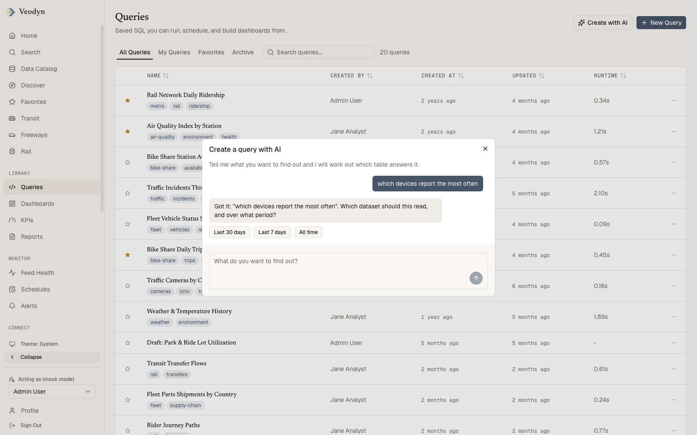

# Veodyn

**One source of truth for a region's transportation operations.** Veodyn pulls
from the systems an agency already runs, normalizes what arrives, stores it
locally, serves it over an API, and draws it. This repository is the community
node: open source, self-hosted, and complete on its own.

[Website](https://veodyn.com) ·
[Documentation](https://docs.veodyn.com) ·
[Live demo](https://demo.veodyn.com) ·
[Getting started](https://docs.veodyn.com/getting-started/) ·
[Connectors](https://docs.veodyn.com/connectors/) ·
[Editions](https://docs.veodyn.com/editions/)

[](https://github.com/veodyn/veodyn-ce/actions/workflows/frontend-test.yml)
[](https://github.com/veodyn/veodyn-ce/actions/workflows/veodyn-api-test.yml)
[](https://github.com/veodyn/veodyn-ce/actions/workflows/redash-test.yml)
[](https://github.com/veodyn/veodyn-ce/actions/workflows/helm-render-test.yml)
[](https://github.com/veodyn/veodyn-ce/actions/workflows/tree-guards.yml)
[](LICENSE)

| | |
|---|---|
|  |  |
|  |  |

More captures of every screen are in [`docs/static/img/screenshots/`](docs/static/img/screenshots/),
and the [documentation](https://docs.veodyn.com) walks through each one.

## Nodes, hubs and editions

**A node is a complete Veodyn instance scoped to one agency.** Five surfaces:
adapters for the feeds and systems it already has, normalization into typed
columns, a local warehouse, an API, and visualization. A **hub** runs those
same five surfaces over its own data and adds a federation layer that
aggregates across the nodes registered with it. The hub layer is commercial
and is not part of this repository.

Veodyn is white-label by design. Brand name, logo, accent colour, chart
palette, fonts, domains and feature flags all come from one YAML file, so an
instance can carry someone else's name without carrying a fork.

This tree is the **community node, in full**. Veodyn Enterprise adds a
management layer on top (KPIs, governed reports, alerts, wall and presentation
modes, shared-link governance, rider messaging, enterprise SSO, the AI digest)
and is licensed commercially. There is no license key and no entitlement
runtime anywhere in Veodyn: a community build simply does not contain that
code, and nothing in it advertises a feature you cannot use. The full matrix is
on the [Editions](https://docs.veodyn.com/editions/) page.

To see the product running without installing anything, open the
[live demo](https://demo.veodyn.com). It is an Enterprise node, so it shows
the management layer too. Pick one of the demo personas on the sign-in page;
the demo accounts are shared and reset regularly.

## What is in it

- **Connectors** for the sources an agency already runs: GTFS-Realtime, static
  GTFS, GBFS bikeshare, GOFS on-demand, TODS, WZDx work zones, Waze, AirNow,
  OpenWeatherMap, TrafficLand cameras, Geotab fleet, MetroCloudAlliance,
  NTCIP 1203 dynamic message signs, TMDD center-to-center, freeway detector
  stations, regional traveler-information feeds and static GeoJSON, beside the
  usual SQL and warehouse sources. A query against a feed connector is a JSON endpoint
  descriptor rather than SQL, and the rows come back as typed columns.
  [Connectors](https://docs.veodyn.com/connectors/)
- **Historical capture** of any feed into ClickHouse on a cadence you declare,
  so a realtime source becomes a queryable history.
  [Captures](https://docs.veodyn.com/features/captures/)
- **Queries**: a SQL editor with a schema browser, parameters, schedules,
  forking, snippets and per-query permissions, plus a no-code visual builder
  that composes SQL from field picks.
  [Queries](https://docs.veodyn.com/features/queries/)
- **Visualizations**: 15 core types (table, chart, counter, pivot, funnel, map,
  heatmap, sankey, choropleth, cohort, sunburst, word cloud and more), each
  with a live-preview editor, and visualization plugins an instance can
  install. [Visualizations](https://docs.veodyn.com/features/visualizations/)
- **Dashboards**: results on a drag-and-drop grid, with auto-refresh,
  dashboard-level parameters, annotations, and revocable public links and
  embeds. [Dashboards](https://docs.veodyn.com/features/dashboards/)
- **Data catalog**: browsable datasets with schema, coverage and freshness,
  grouped into domains the instance defines, each with its own page.
  [Data catalog](https://docs.veodyn.com/features/data-catalog/)
- **Feed health**: whether each upstream feed is current, judged against a
  cadence you declare rather than taken on the feed's word, beside the page
  that says whether scheduled queries are keeping up.
  [Connect](https://docs.veodyn.com/features/connect/)
- **Published feeds**: declare a GBFS or GTFS-Realtime feed over your own
  data, validate it, and serve it publicly.
  [Published feeds](https://docs.veodyn.com/features/published-feeds/)
- **AI**: a chat that drafts queries, dashboards and snippets, grounded in what
  the instance actually holds, plus SQL generation and editing in the editor.
  The model writes the words and code assigns the ids, so a suggestion cannot
  cite something that does not exist. Every flow AI assists also has a manual
  path, and with AI off the affordances are absent rather than greyed out.
  [AI](https://docs.veodyn.com/features/ai/)
- **Interfaces**: a REST API with per-query API keys, and an MCP endpoint so
  an agent of your own can ask the node questions.
  [API](https://docs.veodyn.com/api/)
- **Governance**: users, groups, data-source permissions, system status, email
  and webhook destinations, password and Google sign-in.
  [Settings](https://docs.veodyn.com/features/settings/)

## Quick start

Docker and Docker Compose are the only prerequisites.

```bash
docker compose up -d --build
```

That is the whole install. [`compose.yaml`](compose.yaml) at the repository
root builds all three services and bootstraps itself: it creates both
databases, runs both migration sets (the query service's own schema creation
and the sidecar's Alembic revisions), generates its own cookie secret and API
keys into a volume, seeds a query-service admin plus a separate non-admin
service account for the KPI worker, and hands each service the key it needs.
Nothing has to be prepared on the host first, and no credential is committed
here.

| Service | Local URL |
|---|---|
| Frontend | http://localhost:3000 |
| Query service | http://localhost:5001 |
| veodyn-api | http://localhost:8090 |
| ClickHouse | http://localhost:8123 |
| Mail catcher | http://localhost:1080 |

Every one of those ports is overridable (`VEODYN_APP_PORT`,
`VEODYN_REDASH_PORT`, `VEODYN_API_PORT`, `VEODYN_CLICKHOUSE_PORT`,
`VEODYN_MAILDEV_PORT`), which matters mainly if you also run the query
service's own development stack in `node/`, whose defaults collide with these.
PostgreSQL and Redis publish no host port at all; they are reachable only from
inside the stack's network.

Sign in as the seeded admin, `admin@example.com` unless you set
`VEODYN_ADMIN_EMAIL`. Its password is generated on first boot and printed once,
to the bootstrap container's log:

```bash
docker compose logs redash-bootstrap
```

Set `VEODYN_ADMIN_PASSWORD` before the first `up` to choose one yourself, in
which case nothing is printed.

The stack is ten long-running containers and three one-shot bootstrap steps.
Healthchecks are declared on seven of the ten, and everything downstream waits
on them, so a `docker compose up` that returns is a running stack rather than a started
one. To prove that from nothing:

```bash
./compose/smoke-test.sh
```

It runs `docker compose down -v` first, so it deletes this project's databases
and rebuilds from an empty Docker. Then it waits for each healthcheck, asserts
all three bootstrap containers exited 0, asserts the frontend, the query
service and the sidecar answer on `/api/health_check`, `/ping` and `/health`,
checks the sidecar's schema is at its head revision, verifies both seeded API
keys, and signs the admin in through the frontend's own login route. A stack
that answers a health check but cannot sign anyone in is not a working stack,
so it checks that too.

If you only want to look at the interface, the frontend runs standalone on
bundled demo fixtures with no backend and no database at all: `cd app && pnpm
install && pnpm dev`, leaving `NEXT_PUBLIC_REDASH_URL` unset.

[Getting started](https://docs.veodyn.com/getting-started/) covers the same
stack piece by piece: the frontend in mock mode, the query service on its own,
the sidecar, AI, and live transit data.

## How it fits together

Three services and three datastores, shaped by one rule: **the browser only
ever talks to the frontend.** Every backend call goes through a same-origin
proxy route on the Next.js server, authenticated with the user's own session,
so backend URLs and credentials never reach the client.

- **`app/`** is the product: a Next.js 16 App Router frontend in TypeScript. It
  renders every screen, and its server side hosts the proxy routes under
  `src/app/api/*`.
- **`node/`** is the query service, backend only. Its React client and
  `viz-lib` package were deleted, leaving a headless API. It is the system of
  record for queries, results, schedules, dashboards, users, groups and
  data-source permissions, and it carries the transportation connectors,
  historical capture into ClickHouse, and JSON invite and password-reset
  endpoints so the frontend can drive account flows without a second web UI.
- **`api/`** is a FastAPI sidecar owning everything the query service's data
  model does not: the data catalog, domain pages, favorites, tags, feeds and
  the AI provider. It stores no users. Every request's identity is resolved by
  forwarding the caller's credential to the query service, so permissions stay
  in one place. Where there is no caller to borrow a credential from it acts as
  a dedicated service account.

Behind them: PostgreSQL (a database for the query service, another for the
sidecar), Redis (shared, one database index per consumer), and ClickHouse as
the historical warehouse, written by the query service's opt-in capture layer
and read by the catalog. The frontend never talks to ClickHouse directly.

Identity is the query service's, everywhere. Because query reads ride the
user's own session, a user cannot read a result their groups do not allow, no
matter which service asked. [Architecture](https://docs.veodyn.com/architecture/)
has the diagram, the route-to-credential table, and the two deliberate
exceptions.

## Repository layout

| Path | What it is |
|---|---|
| `app/` | The Next.js frontend (pnpm, TypeScript). Has its own `Dockerfile`. |
| `api/` | The FastAPI sidecar (uv, Python 3.11). Has its own `Dockerfile`. |
| `node/` | The query service (Poetry, Python 3.13), headless. Keeps its own conventions: Black at 119 columns and ruff, not this repository's formatting. |
| `docs/` | The Docusaurus site published at [docs.veodyn.com](https://docs.veodyn.com), and the screenshots it uses. |
| `compose.yaml`, `compose/` | The local stack above, its bootstrap scripts and its smoke test. |
| `helm/charts/` | A chart per service, each with example values files beside it. |
| `ci/` | Pipeline manifests. The test and build jobs live here; the deploy jobs belong to whichever tree carries a particular deployment. |
| `scripts/` | Repository-wide guards (a credential scan, a public-tree check, a de-branding check) and development utilities. |

## Working on it

```bash
cd app && pnpm install && pnpm dev     # mock mode when NEXT_PUBLIC_REDASH_URL is unset
cd api && uv sync --python 3.11 && uv run pytest
```

The frontend and the sidecar share committed API contracts (`api/openapi.json`
and the generated TypeScript types), and CI diffs them, so contract drift is
caught before an image is built. Lint runs with zero warnings tolerated, and
the frontend's test command does not type-check, so run `tsc --noEmit`
separately. [Development](https://docs.veodyn.com/operations/development/) has
the full set of commands and the conventions each half keeps.

## Deploying it

The reference deployment is Kubernetes with Helm. Each service ships a
Dockerfile, and `helm/charts/` holds a chart per service with an example values
file beside it that renders on its own, so you can read the manifests a chart
produces before writing any values of your own.

What is deliberately not in this repository is any particular deployment. The
per-environment values, the provisioning scripts, the cluster credentials and
the pipeline that pushes releases belong wherever that deployment lives.
[Deployment](https://docs.veodyn.com/operations/deployment/) is written for
someone installing their own, and covers the three releases, the datastores,
how secrets are referenced rather than written into values, ingress, and a
first-deploy checklist whose order matters. It also covers how Veodyn
Enterprise and an agency's own extensions are overlaid onto this tree at build
time.

## Contributing, security, licensing

- [CONTRIBUTING.md](CONTRIBUTING.md): getting it running, the three test
  suites, and the CI gates that fail for reasons that surprise people.
- [SECURITY.md](SECURITY.md): how to report a vulnerability, which is not by
  opening an issue.
- [LICENSE](LICENSE): the GNU Affero General Public License, version 3, which
  covers this repository. Running an unmodified build and offering it over a
  network is satisfied by pointing at this repository; modify it and offer that
  over a network, and the modified source goes with it. If those terms do not
  suit what you are building, the maintainers can license this code to you on
  other terms, which is also how Veodyn Enterprise is sold. Ask.
- [NOTICE](NOTICE): the copyright notice, and the two directories that began as
  another project's code (`node/`, and the Helm chart under
  `helm/charts/flow/`). Both keep the license file they were obtained under,
  and that file says what a redistribution has to retain.
