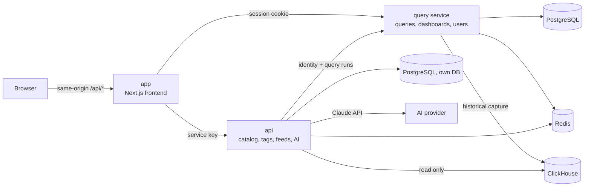

# Architecture

A **node** is a complete Veodyn instance scoped to one agency. It runs on
infrastructure that agency controls, it is the system of record for that
agency's transportation data, and it works standing alone. This page describes a
node.

Internally a node is three services plus three datastores, and one rule shapes
how they connect: **the browser only ever talks to the frontend.** Every backend
call goes through a same-origin proxy route on the Next.js server, authenticated
with the user's own session, so backend URLs and credentials never reach the
client.

This page describes the community edition, which is the whole of this
repository. The [enterprise edition](/editions) adds code to two of these three
services and changes none of the connections below.

## The five surfaces

A node is sold as five surfaces. They are a description of what it does, not of
how it is packaged, so each one is delivered by a different slice of the three
services below. This table is the map between the two vocabularies:

| Surface | Delivered by |
|---|---|
| **Adapters** | Query runners in the query service. Eleven transportation connectors ship today, beside the SQL and warehouse sources. See the [connector list](/connectors) |
| **Normalization** | JSON endpoint descriptors resolved to typed columns by the runner, and scheduled results captured into ClickHouse in a stable shape |
| **Warehouse** | PostgreSQL as the system of record, ClickHouse as the historical store, both local to the node |
| **APIs** | The query service's REST API, the sidecar's REST API, the MCP endpoint, and per-query API keys |
| **Visualization** | The frontend: 15 core types, dashboards, plugins, embeds, and Create with AI |

## Nodes and hubs

A **hub** runs the same five surfaces over its own data, and adds a federation
layer on top: it registers member nodes, aggregates across them, and pushes
selected data back down. The default direction is node to hub; nodes never talk
to each other directly.

Federation is what a hub is for, and it is the commercial part of the product.
**None of it is in this repository**, so nothing on this documentation site
describes it. A node is complete without it: an agency running one standing
alone is not running a degraded version of anything.

## The services

The same edges in full, with the credential each one carries, which is the part
the diagram cannot show. The first row is the invariant the rest of the design
follows from: there is no second row starting at the browser.

| From | To | Carrying |
|---|---|---|
| Browser | app (frontend) | Same-origin `/api/*` only, with the user's session cookie |
| app | Query service | The user's own session cookie, or the internal admin key on `/api/admin/*` after an admin check |
| app | api (sidecar) | A service key, with the caller's identity forwarded for resolution |
| app | AI provider | A shared bearer key. The user's cookie is stripped before the call leaves |
| Query service | PostgreSQL, Redis | Its own database, and its job queues |
| Query service | ClickHouse | Historical capture, write, opt-in per data source |
| api | PostgreSQL, Redis | Its own database and its own Redis index |
| api | ClickHouse | The data catalog, read only |
| api | Query service | Identity resolution, and query runs |
| api | AI provider | The Claude API |

### app (frontend)

A Next.js App Router application. It renders every screen, and its server side hosts the proxy routes under `src/app/api/*`:

| Route prefix | Backend | Credential |
|---|---|---|
| `/api/node/*` (`/api/redash/*` is a deprecated alias, kept for one release) | The query service | The user's own session cookie, so the query service enforces per-user permissions |
| `/api/admin/*` | The query service | An internal admin API key, used only after verifying the caller's own session holds the required admin permission |
| `/api/catalog`, `/api/domains/*`, `/api/tags`, `/api/feeds*`, `/api/favorites*` | api | The caller's identity is forwarded and resolved against the query service |
| `/api/ai/*` | The AI provider | A shared bearer key; the user's cookie is stripped before the call leaves |

The `/api/node/*` prefix is a path, not a description of what is behind it: it
addresses the query service, and it keeps that spelling because changing a
deployed route is a breaking change for anything already calling it.

If a backend for a surface is not configured, that surface answers 503 and the app falls back to demo fixtures rather than breaking.

### The query service

The "flow" service, in `node/`: the system of record for queries, query results, schedules, dashboards, visualization widgets, users, groups, and data-source permissions. It also carries:

- **Transportation connectors**: adapters that poll a live transit, traffic, weather or fleet API with JSON endpoint descriptors instead of SQL. See the [connector list](/connectors) for the public set.
- **Historical capture**: an admin can opt a data source in, and every scheduled result of its queries then lands in ClickHouse, so a warehouse of feed history accumulates on its own.
- **JSON invite and password-reset endpoints** so the Veodyn frontend can drive account flows without a second web UI.

The service ships a legacy web UI of its own that still exists and works, but Veodyn users never see it; the frontend replaces it completely.

### api (sidecar)

A FastAPI service owning everything the query service's data model does not: the **data catalog** (a read-only view over ClickHouse), **domain pages**, **tags**, **favorites**, **feed health and expectations**, and the **AI provider**.

It stores no users. Every request's identity is resolved by forwarding the caller's credential to the query service, so permissions stay in one place. It has its own PostgreSQL database. Where there is no caller to borrow a credential from, arming a feed alert or assembling AI grounding, it acts as a dedicated **service account**.

**A community deployment runs no sidecar worker.** The only recurring job the
sidecar has ever had evaluates KPIs, which are enterprise, so the whole worker
package ships with the [enterprise pack](/editions). There is no `api-worker`
service in the local Compose stack and no worker release in the Helm chart; a
deployment that installs the pack adds both back.

Adding the pack registers extra HTTP routers, extra object kinds in the
tag/favorite registry, extra domain-page counter providers, and a second Alembic
chain with its own version table. The seam is one environment variable,
`VEODYN_EXTRA_MODULES`, read at startup; nothing else in this service knows the
pack exists.

### ClickHouse (historical warehouse)

Written by the query service's capture layer (scheduled results, opt-in per data source) and read by the sidecar's data catalog and by the query service itself through a "historical" data source. The frontend never talks to ClickHouse directly.

## Identity and permissions

- **One identity system: the query service.** Users, groups, and data-source access live there. The frontend logs in against it, the sidecar resolves identities against it.
- **Per-user enforcement everywhere.** Because query reads ride the user's own session, a user can never read a result their groups do not allow, no matter which service asked.
- **The AI path is the exception**, by design: AI grounding runs as the service account, so a suggestion can name (but never show) a query the reader cannot open. Result reads still go through the query service under the reader's own credential.
- **Admin routes are double-gated**: the internal admin key is only used after the caller's own session proves the admin permission.

## Public surfaces

Dashboards and single visualizations can be shared by unlisted token URLs (`/dashboards/public/<token>`, `/embed/public/<token>`). Tokens are lookup keys: a revoked or unknown token gets a neutral refusal page that never echoes the token.

Public report links (`/reports/public/<token>`) and the **Admin → Shared Links** audit and bulk-revoke surface are [enterprise](/editions): both are served by routes a community build does not register.

Each service also has its own ingress in production, so anything that must always happen on a request (an org check, audit logging) lives in the backend that resolves the token, not in the frontend proxy.

## Repository layout

| Path | Contents |
|---|---|
| `app/` | The Next.js frontend |
| `node/` | The query service |
| `api/` | The FastAPI sidecar |
| `helm/` | Helm charts and per-environment values |
| `ci/` | CI pipeline manifests |
| `docs/` | This documentation site, plus internal engineering notes |

The `node/` directory holds one service, not a whole node. It predates the
current naming and is left alone deliberately: the path is referenced by the
build, the charts and the packs that overlay onto this tree, so renaming it is a
coordinated change rather than a cosmetic one.
